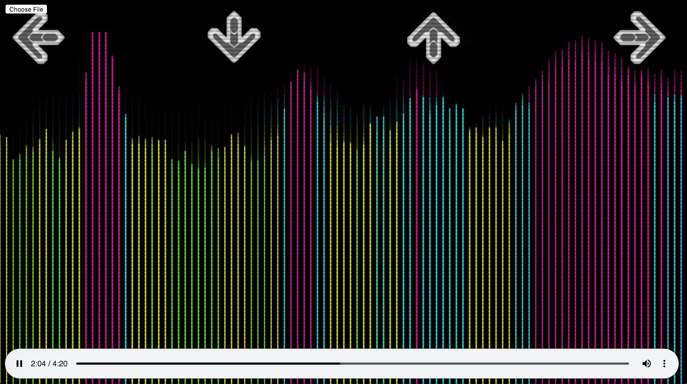

# Synesthesia

## Background and Overview

Synesthesia is an audio visualizer made using Web Audio API and Canvas. The visualizer consists of frequency bars of varying heights that are generated and rendered in real time and synchronized with a piece of music.

Synesthesia is also a rhythm-based game. As soon as the frequency bars reach a certain height on the screen, the arrow key on the corresponding section of the screen will change color, thus indicating to the user that they are expected to press that particular arrow key. In doing so, users can accumulate points throughout the duration of the song. 

## Functionality and MVPs

In Synesthesia, users will be able to
* Upload any MP3 file of their choice
* See the music visualization in real time
* Start, pause, and restart the visualization
* Play a rhythm-based game that is synchronized with the visualization

## Screenshots

## Technologies and APIs

* Vanilla JavaScript for structure and logic
* HTML5 Canvas for DOM manipulation and rendering
* Web Audio API for decoding audio data
* Webpack to bundle and serve up the various scripts

## Implementation Timeline

### Day 1
* Start canvas mapping and animation
* Research Web Audio API
* Develop project skeleton

### Day 2
* Use Web Audio API to analyze music and map data points onto canvas

### Day 3
* Continue to use Web Audio API to analyze music and map data points onto canvas in desired visualizer shape and animation 

### Day 4
* Render play bar at the bottom
* Give user the option to upload an MP3 file
* Provide options for users to select up to four colors for visualizer

### Day 5
* Measure length of visualizer in cardinal directions and determine where user should press arrow keys
* Start logic for user to press arrow keys whenever the visualizer reaches a certain length

### Day 6
* Continue working on logic for user to press arrow keys at the same time as the visualizer reaching a certain length
* Give the user points for accurately pressing on the correct arrow key

### Day 7
* Finish any remaining game/visualizer logic

