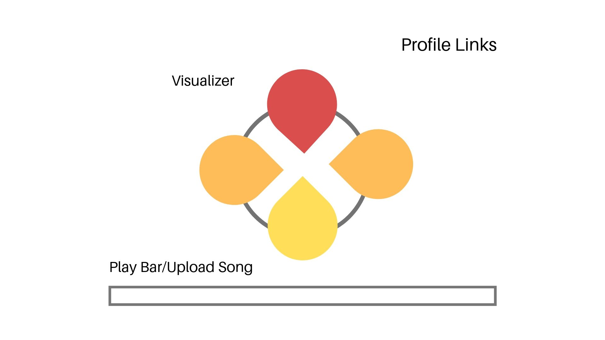

# Synesthesia

## Background and Overview

Synesthesia is an audio visualizer made using Web Audio API and Canvas. The visualizer is circular in shape, with protrusions of varying lengths at the top, left, right, and bottom that are generated and rendered in real time and synchronized with a piece of music.

In the future, Synesthesia will also be a rhythm-based game in which users press the arrow keys at the same time as the protrusions of a given direction — top, left, right, or bottom. Once the protrusion reaches a certain length, the user will be expected to press the corresponding arrow key and accumulate points throughout the duration of the song. Failure to do so, or key presses when there is no corresponding protrusion, would result in point deduction.

## Functionality and MVPs

In Synesthesia, users will be able to
* Upload any MP3 file of their choice
* Choose the four primary colors of the visualizer
* See the music visualization in real time
* Start, pause, and restart the visualization
* (Bonus) Accumulate points by successfully pressing the corresponding arrow keys at the same time as the visualization

## Wireframes

## Technologies and APIs

* Vanilla JavaScript for structure and logic
* HTML5 Canvas for DOM manipulation and rendering
* Web Audio API for decoding audio data
* Webpack to bundle and serve up the various scripts

## Implementation Timeline

Day 1
* Start canvas mapping and animation
* Research Web Audio API
* Develop project skeleton

Day 2
* Use Web Audio API to analyze music and map data points onto canvas

Day 3
* Continue to use Web Audio API to analyze music and map data points onto canvas in desired visualizer shape and animation 

Day 4
* Render play bar at the bottom
* Give user the option to upload an MP3 file
* Provide options for users to select up to four colors for visualizer

Day 5
* Measure length of visualizer in cardinal directions and determine where user should press arrow keys
* Start logic for user to press arrow keys whenever the visualizer reaches a certain length

Day 6
* Continue working on logic for user to press arrow keys at the same time as the visualizer reaching a certain length
* Give the user points for accurately pressing on the correct arrow key

Day 7
* Finish any remaining game/visualizer logic

