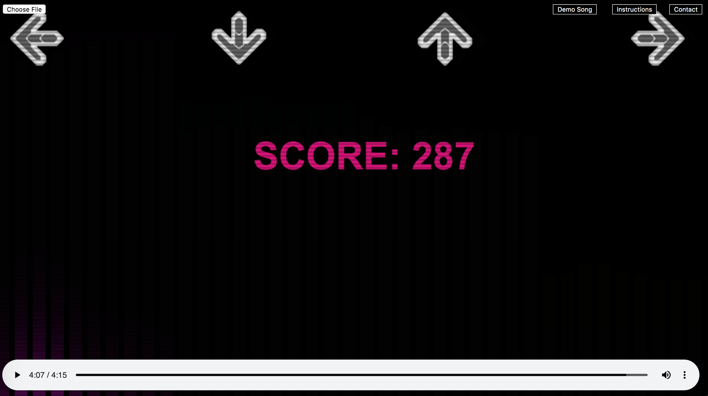

# Synesthesia

## Background and Overview

Synesthesia is a DDR-inspired music-adapting game where users can upload their own music to generate a customized game. The speed and difficulty of each game is determined by the specific song that is uploaded. The game also comes pre-loaded with a demo song, "Cyberpunk" by SYN.

Synesthesia was built with Web Audio API and HTML5 Canvas. When users upload an MP3 file, it generates an audio visualizer that is rendered in real time and synchronized with the song. The visualizer captures frequency data throughout the duration of the song and transforms the data points into bars of varying heights, where the height corresponds to the frequency. The bars are organized from highest to lowest frequencies, and they are separated and color-coded into four equally-sized sections for the purposes of the game.

When four out of the ten frequency bars in a given section reach a certain height on the screen, the arrow key on the corresponding section of the screen will light up in a different color. This color change indicates to the user that they are expected to press that particular arrow key. There is a half-second window during which the user is able to press the correct arrow key. 

For every correct key press, users accumulate one point. When the arrow is pressed correctly, it will change to a slightly more orange color to indicate that it has been successfully pressed.

Incorrect key presses, on the other hand, result in single-point deductions. When the arrow is pressed incorrectly, it will change to a slightly darker gray color to indicate that it was pressed even though the arrow was not lit up.

The points are continuously calculated and rendered on the screen. When the song finishes and the user pauses the audio player, the final score is displayed across the screen.

## Functionality and MVPs

In Synesthesia, users will be able to
* Upload any MP3 file of their choice
* See the audio visualization in real time
* Start, pause, and restart the visualization
* Play a DDR-inspired game that is synchronized with the song

## Technologies and APIs

* Vanilla JavaScript for structure and logic
* HTML5 Canvas for DOM manipulation and rendering
* Web Audio API for decoding audio data
* Webpack to bundle and serve up the various scripts

## Implementation Timeline

### Day 1
* Use Web Audio API to analyze music and map data points onto canvas
* Render audio visualizer for any uploaded MP3 file

### Day 2
* Divide the audio visualizer into four equally sized sections and color-code them accordingly
* Analyze frequency data throughout the course of a song and calculate the threshold height for each of the four sections
* Render the bars in a muted color if they are under the threshold height, and render the bars in a bright color if they are above the threshold height

### Day 3
* Render four gray arrows at the top of the screen
* Transform the gray arrows into colorful arrows when four bars out of the ten in a given section have reached the threshold height
* Provide a half-second delay before transforming the arrows back to gray, thereby giving users a chance to see which arrow has changed color

### Day 4
* Add event listener for key presses
* Determine if key press was correct or incorrect 
* Add a point if the key press was correct, and deduct a point if the key press was incorrect
* Render a darkened gray arrow when a user presses the key incorrectly
* Render an orange-toned colored arrow when a user presses the key correctly

## Plans for the Future

In this current version of Synesthesia, genres such as dubstep and midtempo bass tend to generate the most challenging games, as they hit an extremely wide range of frequencies. Other genres, such as pop and classical, tend to generate less challenging games. 

In the future, Synesthesia can be updated to account for these variations across genres. Extremely high and extremely low frequencies can be omitted, and frequency data can be pulled primarily from the mid-frequency ranges where most songs — regardless of genre — tend to reach. 